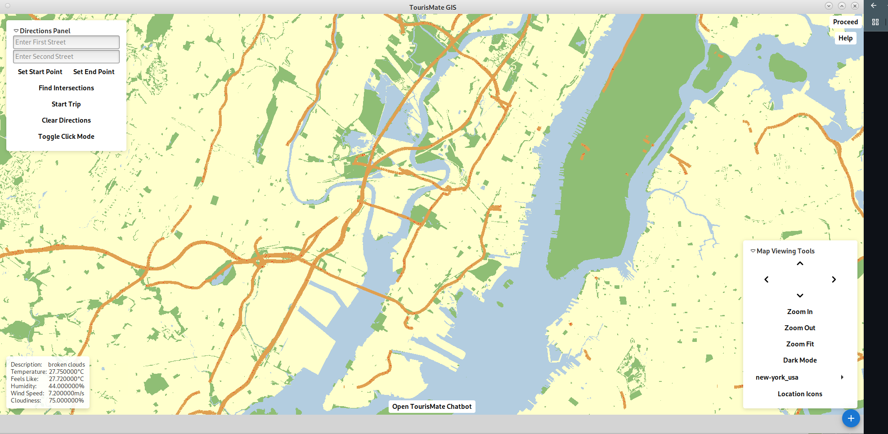
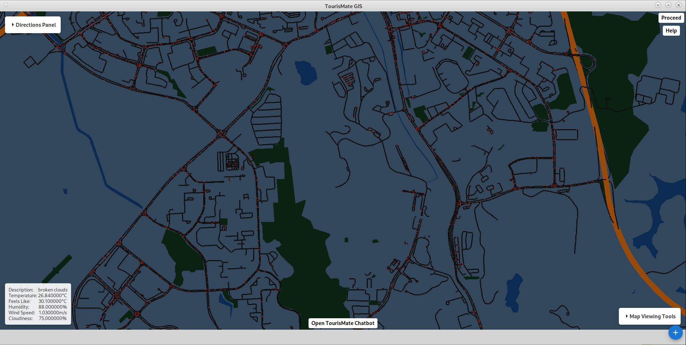

# DISCLAIMER
COPYING CODE IS AN ACADEMIC OFFENSE. THIS CODE IS ONLY FOR REFRENCE

---

## Introduction
his file contains details on the design implementation of a GIS software designed for tourists visiting new cities. We implemented multiple graphical features to make our GUI more intuitive, as well as multiple app features like an AI chatbot, live weather data and pathfinding abilities all geared towards tourists. See the project presentation document for more details. This project was done almost entirely in C++, with libraries like GTK for graphics, also Glade and EZgl.

## User Interface
Our User interface was designed based on state-of-art research comparing interfaces like Strava and HereWeGo maps. It implements a "Swiss army knife" dynamic layout, allowing users to expand and shrink windows based on feature usage. Styling was done with CSS to produce a cleaner layout, with a high contrast shade choice to ensure users can understand what they are looking at. The interface allows users to turn on and off Dark Mode for different map views.

---

## Features
This project includes the following features:
- Feature 1
- Feature 2
- Feature 3

---

## Workflow
Here's how the typical user or system workflow looks:

1. Step one
2. Step two
3. Step three

---
