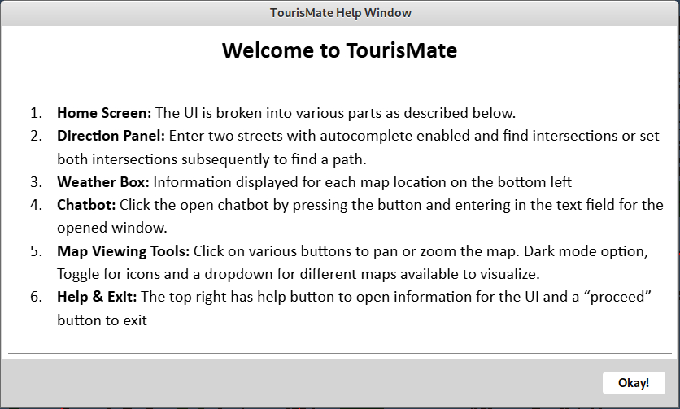
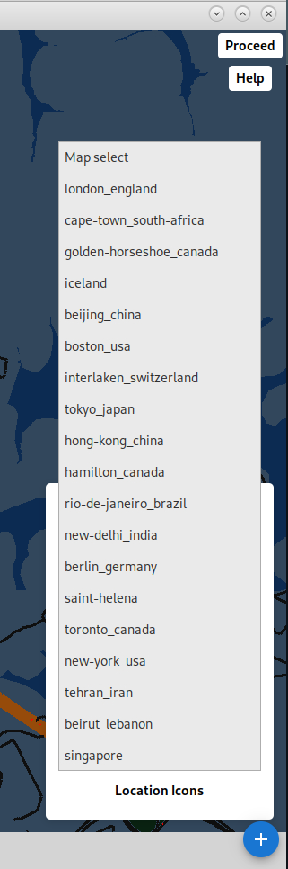
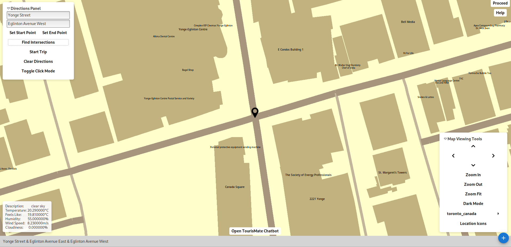
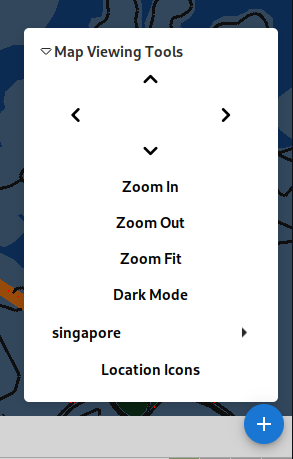
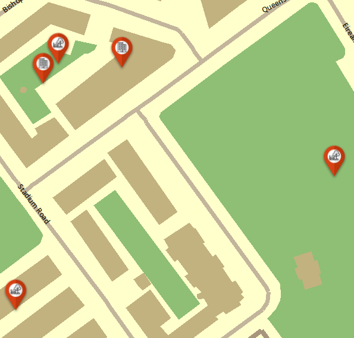
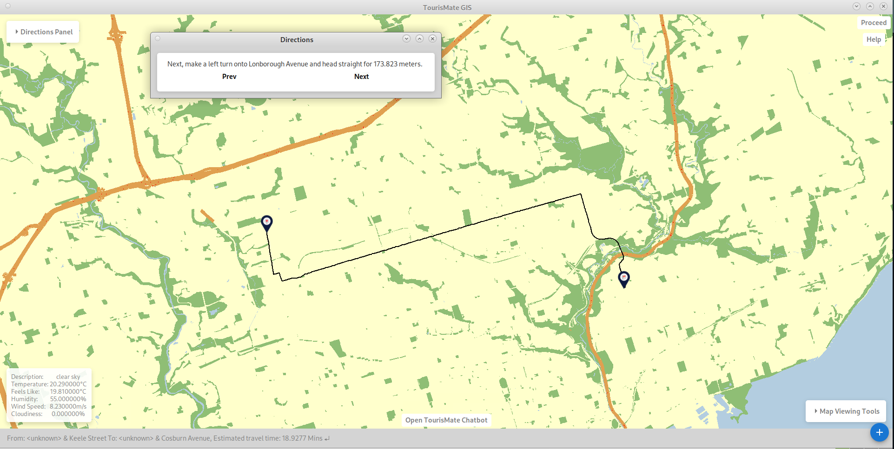
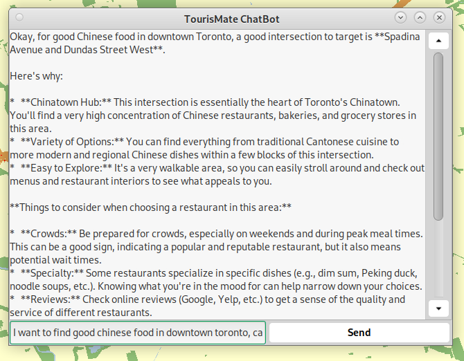

# DISCLAIMER
COPYING CODE IS AN ACADEMIC OFFENSE. CODE FOR THIS PROJECT CANNOT BE SHOWN BUT FEEL FREE TO REACH OUT FOR MORE DETAILS OR A WALKTHROUGH.

---

## Introduction
his file contains details on the design implementation of a GIS software designed for tourists visiting new cities. We implemented multiple graphical features to make our GUI more intuitive, as well as multiple app features like an AI chatbot, live weather data and pathfinding abilities all geared towards tourists. See the project presentation document for more details. This project was done almost entirely in C++, with libraries like GTK for graphics, also Glade and EZgl.

## User Interface
Our User interface was designed based on state-of-art research comparing interfaces like Strava and HereWeGo maps. It implements a "Swiss army knife" dynamic layout, allowing users to expand and shrink windows based on feature usage. Styling was done with CSS to produce a cleaner layout, with a high contrast shade choice to ensure users can understand what they are looking at. The interface allows users to turn on and off Dark Mode for different map views. We implemented a colour scheme that highlights different features like highways, major roads, minor roads, parks, buildings and more, making the maps easily readable. 

---

## Features
We implemented a number of features designed to make travelling easier for tourists and navigation easier for any user:
- Flex coded map upload - simply upload the OSM data file for the map into its designated folder and the map will be fully loadable within our GIS
- Intersection click and search - click on any intersection to select it and have info about it pop up in the message window near the bottom of the screen. Enter the streets of the intersection into our boxes and click find intersections to highlight all matching intersections, and the window will also teleport you to the intersection
- Map viewing abilities like zoom in, zoom out, and movement arrows (users can also zoom and scroll via mouse or trackpad) to allow users to navigate their maps
- Dark mode toggle
- Location icon toggle button to add distinct icons onto key features like parks, waterways and buildings to allow for even more readability
- Pathfinding features - similarly to intersection click and search, users can either enter the first and second intersection into our search box, selecting "set start point" and "set end point", and then click start trip to highlight the route and a directions window will pop up. Users can also click "toggle click mode", and click start and end intersection
- Live weather data - we scraped weather data based on latitude and longitude through LibCurl connected to the LiveWeather API, and used boost property trees to parse the json file
- TourisMate Chatbot - we connected LibCurl to the Gemini API to give users a "digital tour guide" where they could ask get any info they need about their city

<table>
  <tr>
    <td></td>
    <td></td>
    <td></td>
  </tr>
  <tr>
    <td></td>
    <td></td>
    <td></td>
  </tr>
  <tr>
    <td></td>
    <td></td>
    <td></td>
  </tr>
</table>

---

## Implementation and Algorithms
We used EZGL and GTK for buttons and callbacks as well as windows and layout. For pathfinding, we used A star with nodes being intersections and edges being street segments, with the cost being travel time and heuristic being distance. We loaded data from OSM using data structures like linked lists, maps and vectors.

---
